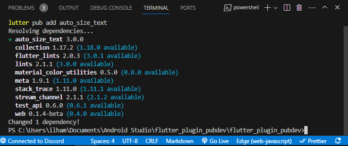
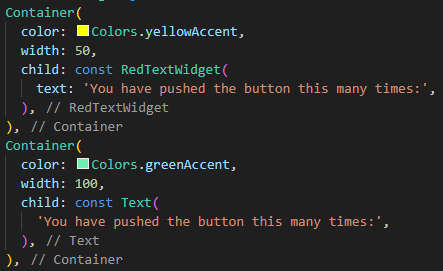
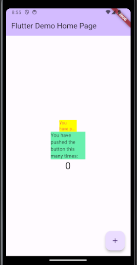

# Jobsheet 7

### Ilham Khalis Putra Agatha
### 2141720230
### 3G/ 12

## Langkah 1: Buat Project Baru

## Langkah 2: Menambahkan Plugin

## Langkah 3: Buat file red_text_widget.dart

## Langkah 4: Tambah Widget AutoSizeText

## Langkah 5: Buat Variabel text dan parameter di constructor

## Langkah 6: Tambahkan widget di main.dart

## Hasil

## Selesaikan Praktikum Menerapkan Plugin di Project Flutter diatas, lalu dokumentasikan dan push ke repository Anda berupa screenshot hasil pekerjaan beserta penjelasannya di file README.md!

## Jelaskan maksud dari langkah 2 pada praktikum tersebut!

flutter pub add auto_size_text" adalah perintah yang digunakan dalam Flutter untuk menambahkan sebuah paket atau library ke proyek Flutter. Dalam kasus ini, perintah ini ditujukan untuk menambahkan paket bernama "auto_size_text" ke proyek Flutter. Ini akan memungkinkan kita untuk menggunakan fitur-fitur yang ada dalam paket "auto_size_text" dalam proyek, seperti auto-sizing teks.

## Jelaskan maksud dari langkah 5 pada praktikum tersebut!

Variabel ini akan digunakan untuk menentukan teks yang akan ditampilkan oleh widget ini. Kemudian, dengan menambahkan parameter required this.text ke dalam constructor RedTextWidget, kita memastikan bahwa saat membuat instance dari RedTextWidget, kita harus memberikan nilai teks yang diperlukan melalui parameter ini.

## Pada langkah 6 terdapat dua widget yang ditambahkan, jelaskan fungsi dan perbedaannya!

Kotak pertama (Container) berwarna kuning dan berisi teks yang telah disesuaikan tampilannya (dalam widget bernama RedTextWidget).

Kotak kedua (Container) berwarna hijau dan berisi teks biasa tanpa penyesuaian khusus (dalam widget bernama Text).

## Jelaskan maksud dari tiap parameter yang ada di dalam plugin auto_size_text berdasarkan tautan pada dokumentasi ini !

Parameter-parameter biasanya digunakan untuk mengkonfigurasi dan menyesuaikan perilaku widget tersebut. Ini bisa termasuk parameter untuk mengatur teks yang ditampilkan, gaya teks, jumlah maksimum baris, efek overflow, dan banyak lagi.

## Kumpulkan laporan praktikum Anda berupa link repository GitHub melalui Assignment ini !

